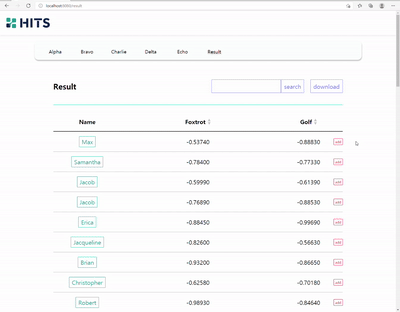

<h1>HITS 프론트엔드 과제</h1>

<h2>구동방법</h2>
 - terminal에서 npm install 또는 yarn을 타이핑하여 패키지를 설치합니다.
 - npm start 또는 yarn start를 사용하여 파일을 실행합니다.

<h2>사용 라이브러리</h2>
 - <b>CRA(typescript)</b>를 사용하여 react로 구성하였습니다.
 - <b>react-router-dom</b>을 사용하여 페이지를 구성하였습니다.
 - <b>swr</b>과 <b>axios</b>를 사용하여 api통신 하였습니다.
 - <b>styled-components</b>를 사용하여 style을 적용하였습니다.
 - <b>airbnb eslint</b>를 적용하여 개발하였습니다.
 
 